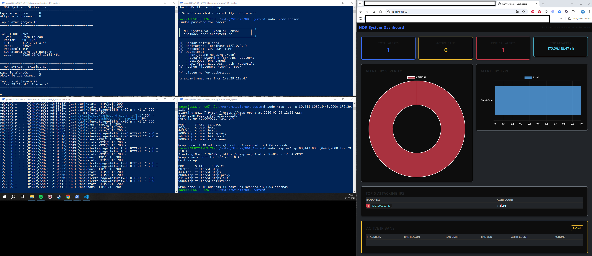

# NDR System - Network Detection & Response v8

Profesjonalnej klasy system wykrywania intruzów sieciowych (NIDS) z funkcjami aktywnego reagowania (IPS).

**Technologie**: C++17 (Sensor) | Python 3.9+ (Kontroler) | Flask (Dashboard) | libpcap | SQLite

## Przegląd systemu

System NDR to modularna, wielowarstwowa architektura bezpieczeństwa:
- **Sensor (C++)** – Przechwytywanie pakietów i detekcja anomalii w czasie rzeczywistym (TCP/UDP/ICMP).
- **Controller (Python)** – Archiwizacja alertów, zarządzanie blokadami IP oraz logika eskalacji incydentów.
- **Dashboard (Flask)** – Wizualizacja danych w czasie rzeczywistym z interaktywnymi wykresami i kontrolą banów.

**Kluczowe funkcjonalności:**
- Detekcja skanowania portów (SYN sweep).
- Wykrywanie skanowania Stealth (rozpoznawanie wzorców nmap -sS).
- Detekcja ataków DoS/DDoS (limitowanie oparte na PPS).
- Głęboka Inspekcja Pakietów (DPI: SQL Injection, RCE, XSS, Path Traversal).
- Automatyczne blokowanie IP poprzez iptables.
- Wielopoziomowa eskalacja blokad (5→10→60 min).
- Webowy panel zarządzania incydentami.

## Architektura

## Struktura Projektu i wyniki testów

* **01_interface_list.cpp** - Rozpoznawanie dostępnych interfejsów sieciowych.

* **02_protocol_sniffer.cpp** - Analiza nagłówków L3 (IP) oraz L4 (TCP, UDP, ICMP).

* **03_ping_flood_detector.cpp** - Wykrywanie i alertowanie ataków typu ICMP Flood.

* **05_port_scan_detector.cpp** - **Kluczowy moduł systemu.** Łączy w sobie:
    * **Analizę stanową (Stateful):** Wykrywanie Port Sweep i Stealth Scan (nmap -sS).
    * **Deep Packet Inspection (DPI):** Analiza warstwy L7 (Payload) pod kątem sygnatur SQL Injection i Path Traversal.
    * **Active Response (IPS):** Automatyczna blokada IP napastnika w firewallu iptables.

* **Architektura Modularna v8 (Sensor + Dashboard)** -
Logika rozbita na moduły (`src/`, `include/`), komunikacja IPC (Unix Sockets) z kontrolerem w Pythonie. Posiada interaktywny panel webowy (Flask) do zarządzania incydentami, odblokowywania IP (Unban) i wizualizacji ataków w czasie rzeczywistym.

## Analiza techniczna i wnioski
W trakcie realizacji projektu zaimplementowano:

* **Pointer Arithmetic & L7 Offset:** Dynamiczne obliczanie przesunięcia wskaźnika (Ethernet + IP_len + TCP_len) w celu precyzyjnego dotarcia do danych aplikacji (Payload) bez narzutu wydajnościowego.
* **Analiza stanowa (Stateful Analysis):** Wykorzystanie `std::map` do korelacji zdarzeń w oknie czasowym, co pozwala na odróżnienie pojedynczych połączeń od zorganizowanych skanów.
* **Deep Packet Inspection (DPI):** Silnik przeszukujący payload pod kątem znanych sygnatur (np. `union select`, `/etc/passwd`). Zastosowano normalizację tekstu (Case Sensitivity), aby zwiększyć skuteczność detekcji.
* **Active Response (IPS):** Integracja sensora z systemowym firewallem (`iptables`). System dynamicznie nakłada reguły `DROP` na adresy IP zidentyfikowane jako źródło ataku, realizując model obronny "Zero Trust".

## Plany rozwoju (Next steps)
* **Zarządzanie sprzętowe:** Przeniesienie sensora na dedykowany terminal z dwiema kartami sieciowymi (tryb Bridge).
* **Powiadomienia:** Telegram Bot wysyłający raporty o krytycznych incydentach bezpośrednio na telefon.
* **Heurystyka:** Implementacja algorytmów wykrywających anomalie statystyczne (np. nagły wzrost ruchu UDP).
* **Optymalizacja:** Migracja silnika sygnatur na bibliotekę Hyperscan dla obsługi ruchu 10Gbps+.