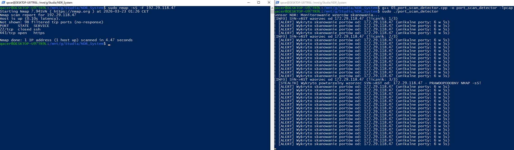
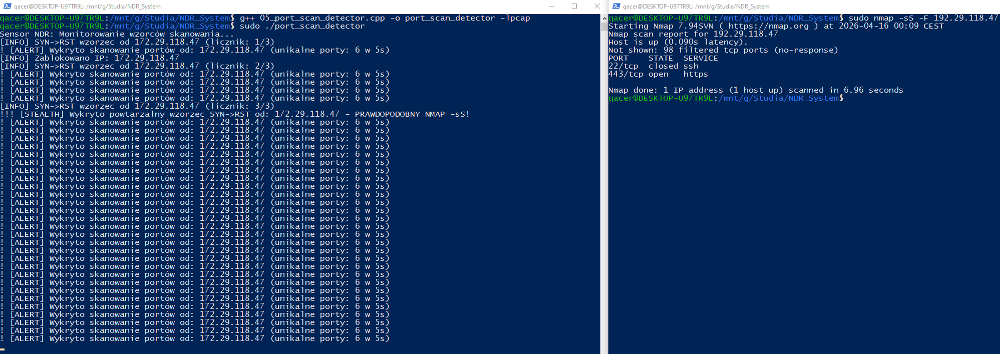
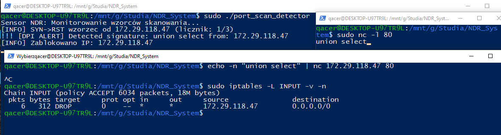

# Projekt NDR/IPS (Network Detection and Response)
Zaawansowany system wykrywania i aktywnego reagowania na incydenty sieciowe w czasie rzeczywistym.

## O Projekcie
Celem projektu jest budowa niskopoziomowego sensora monitorującego ruch sieciowy. System nie tylko analizuje nagłówki pakietów, ale wykonuje głęboką inspekcję zawartości (DPI) i autonomicznie izoluje agresywne hosty.

## Tech Stack
* **Język:** C++ (Sensor), Python (Planowany Dashboard)
* **Biblioteki:** libpcap, netinet
* **Platforma:** Linux (x86/ARM) - Optymalizowane pod Mini PC/Terminal oraz Raspberry Pi.

## Struktura Projektu i wyniki testów

* **01_interface_list.cpp** - Rozpoznawanie dostępnych interfejsów sieciowych.

* **02_protocol_sniffer.cpp** - Analiza nagłówków L3 (IP) oraz L4 (TCP, UDP, ICMP).

* **03_ping_flood_detector.cpp** - Wykrywanie i alertowanie ataków typu ICMP Flood.

* **05_port_scan_detector.cpp** - **Kluczowy moduł systemu.** Łączy w sobie:
    * **Analizę stanową (Stateful):** Wykrywanie Port Sweep i Stealth Scan (nmap -sS).
    * **Deep Packet Inspection (DPI):** Analiza warstwy L7 (Payload) pod kątem sygnatur SQL Injection i Path Traversal.
    * **Active Response (IPS):** Automatyczna blokada IP napastnika w firewallu iptables.

## Analiza techniczna i wnioski
W trakcie realizacji projektu zaimplementowano:

* **Pointer Arithmetic & L7 Offset:** Dynamiczne obliczanie przesunięcia wskaźnika (Ethernet + IP_len + TCP_len) w celu precyzyjnego dotarcia do danych aplikacji (Payload) bez narzutu wydajnościowego.
* **Analiza stanowa (Stateful Analysis):** Wykorzystanie `std::map` do korelacji zdarzeń w oknie czasowym, co pozwala na odróżnienie pojedynczych połączeń od zorganizowanych skanów.
* **Deep Packet Inspection (DPI):** Silnik przeszukujący payload pod kątem znanych sygnatur (np. `union select`, `/etc/passwd`). Zastosowano normalizację tekstu (Case Sensitivity), aby zwiększyć skuteczność detekcji.
* **Active Response (IPS):** Integracja sensora z systemowym firewallem (`iptables`). System dynamicznie nakłada reguły `DROP` na adresy IP zidentyfikowane jako źródło ataku, realizując model obronny "Zero Trust".

## Plany rozwoju (Next steps)
* **Szyna danych (Integration):** Implementacja Unix Domain Sockets do szybkiego przekazywania alertów z C++ do warstwy analitycznej w Pythonie.
* **Web Dashboard:** Budowa interfejsu w Pythonie (FastAPI/Streamlit) do wizualizacji zagrożeń i zarządzania bazą zablokowanych hostów.
* **Heurystyka:** Wprowadzenie prostych algorytmów oceny ryzyka dla hostów na podstawie historii ich aktywności.