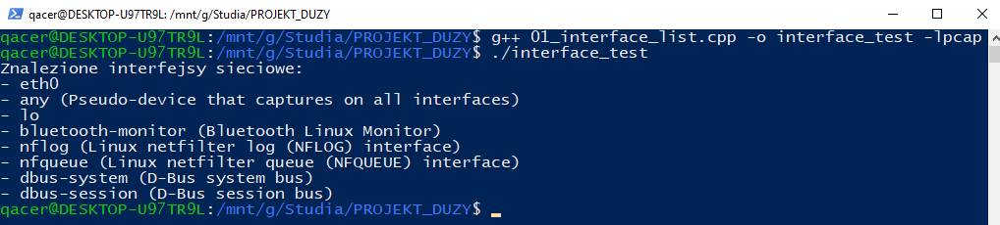
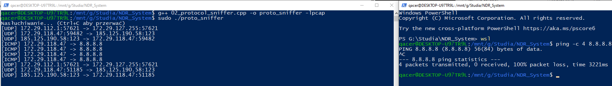
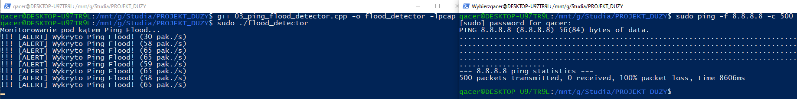

# Projekt NDR/IDS na Raspberry Pi
System wykrywania i reagowania na incydenty sieciowe (Network Detection and Response).

## O Projekcie
Celem projektu jest budowa sensora monitorującego ruch sieciowy w czasie rzeczywistym. System analizuje pakiety niskopoziomowo w celu wykrywania anomalii.

## Tech Stack
* Jezyk: C++ (Sensor), Python (Analiza i Logika)
* Biblioteki: libpcap
* Sprzet: Raspberry Pi

## Struktura Projektu i wyniki testów

* **01_interface_list.cpp** - Rozpoznawanie interfejsów sieciowych.

* **02_protocol_sniffer.cpp** - Analiza nagłówków IP, TCP, UDP i ICMP.

* **03_ping_flood_detector.cpp** - Wykrywanie ataków Ping Flood.

* **05_port_scan_detector.cpp** - Zaawansowana detekcja skanowania (Stateful). Rozpoznaje klasyczny "port sweep" oraz ciche skany typu Stealth (SYN-RST).

## Analiza techniczna i wnioski
W trakcie realizacji tych etapów skupiłem się na następujących zagadnieniach:

* **Rzutowanie struktur (Pointer Casting):** Zrozumienie, w jaki sposób przesunięcie wskaźnika o 14 bajtów (rozmiar nagłówka Ethernet) pozwala na bezpośrednie mapowanie surowych danych z bufora na strukturę `iphdr`. Pozwala to na uniknięcie kosztownego kopiowania danych.
* **Analiza warstwy transportowej:** Implementacja rozpoznawania protokołów TCP, UDP oraz ICMP na podstawie pola `protocol` w nagłówku IP.
* **Detekcja anomalii:** Opracowanie algorytmu zliczającego pakiety w oknie czasowym (1 sekunda) w celu identyfikacji ataków typu Flood.
* **Analiza stanowa (Stateful Analysis):** Implementacja mechanizmu "pamięci" sensora przy użyciu `std::map`. Pozwala to na korelację wielu pakietów od tego samego hosta w oknie czasowym, zamiast analizowania ich w izolacji.
* **Wzorzec SYN-RST:** Opracowanie logiki wykrywającej specyficzne zachowanie skanerów (np. `nmap -sS`), które wysyłają pakiet RST natychmiast po otrzymaniu odpowiedzi, aby uniknąć pełnego zestawienia połączenia.

## Plany rozwoju (Next steps)
* **Active Response:** Implementacja modułu automatycznego blokowania adresów IP poprzez dynamiczną modyfikację reguł `iptables` po przekroczeniu progu alertowego.
* **ICMP Anomaly Detection:** Rozszerzenie detekcji o analizę anomalii w protokole ICMP (nietypowe rozmiary pakietów, Ping Flood).
* **Payload Inspection:** Wstępna analiza zawartości pakietów pod kątem znanych sygnatur exploitów.
